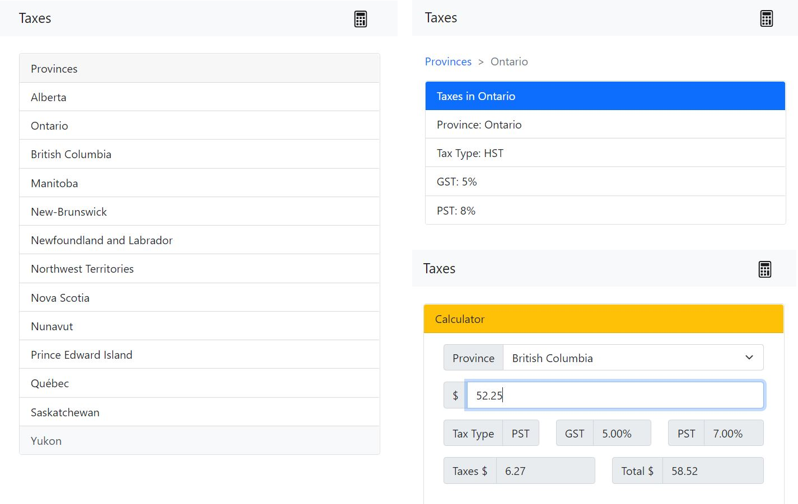

# Module C - Web Apps

The overall structure of the project is as follows:
```
.
├── controllers
│   ├── tax-api.js
├── models
│   ├── tax-dao.js
│   └── tax-orm.js
├── public
│   ├── css (empty)
│   ├── fragments
│   │   ├── calculator-page.html
│   │   ├── province-dropdown-item.html
│   │   ├── province-item.html
│   │   ├── provinces-page.html
│   │   └── tax-page.html
│   ├── js
│   │   ├── script.js
│   │   └── script-v2.js
│   ├── index.html
│   └── index-v2.html
├── node_modules
├── config.json
├── index.js
├── package.json
├── README.md
└── routes.js
```

To start the demo, run `node index.js 5000` and then go to your web browser and
navigate to [`http://localhost:5000/`](http://localhost:5000/).
There are two versions of the demo, at [`http://localhost:5000/`](http://localhost:5000/)
and at [`http://localhost:5000/index-v2.html`](http://localhost:5000/index-v2.html).
The first version ([`index.html`](public/index.html) and [`script.js`](public/js/script.js))
includes all the templates in the webpage, while the second version
([`index-v2.html`](public/index-v2.html) and [`script-v2.js`](public/js/script-v2.js))
is just an application shell and the page templates are dynamically retrieved
from the server via AJAX and stored within the [`fragments`](public/fragments) directory.



There are also two database model implementations, the
[`models/tax-dao.js`](models/tax-dao.js) and
[`models/tax-orm.js`](models/tax-orm.js). One implementation uses SQLite
directly and the other uses Sequelize as an ORM. To switch between the two,
uncomment the code in [`controllers/tax-api.js`](controllers/tax-api.js), lines
[`4`](controllers/tax-api.js#L4), [`15`](controllers/tax-api.js#L15) and
[`33`](controllers/tax-api.js#L33), and comment out lines
[`3`](controllers/tax-api.js#L3), [`16`](controllers/tax-api.js#L16),
[`32`](controllers/tax-api.js#L32) and [`34`](controllers/tax-api.js#L34). There are
two APIs implemented: `/api/taxes` and `/api/taxes/:code`.

## Other Examples

- [Todos App](examples/todos)
